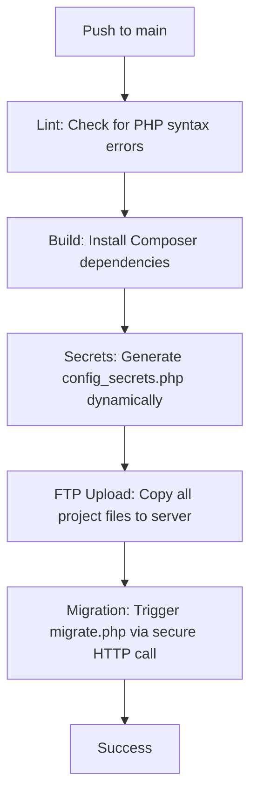

# FTP Deployment and Database Migration Guide (InfinityFree / Shared Hosting)

This guide explains how to set up automatic deployment for the Plasma Lab website to a free shared hosting service (like **InfinityFree**) using GitHub Actions.

Since free shared hosting services do not support SSH, this setup uses **FTP** to upload your files, and triggers database migrations securely via an **HTTP web-hook**.

---

## 1. Get Free Hosting on InfinityFree

1. Go to **[infinityfree.com](https://infinityfree.com)** and sign up for a free account.
2. Create a new hosting account inside your client area.
3. Choose a domain name (you can use a free subdomain like `yoursite.infinityfreeapp.com`).
4. Once created, write down your **FTP Details** from your InfinityFree Client Area:
   - **FTP Host** (usually `ftpupload.net`)
   - **FTP Username** (starts with `epiz_`)
   - **FTP Password**

---

## 2. Set Up a MySQL Database on InfinityFree

1. Log into your InfinityFree account and click **Control Panel** (cPanel).
2. Find the **Databases** section and click on **MySQL Databases**.
3. Create a new database (e.g., `plasma_lab_ru`).
4. Once created, copy the database connection details:
   - **MySQL Hostname** (e.g., `sql123.epizy.com`)
   - **MySQL Database Name** (e.g., `epiz_12345678_plasma_lab_ru`)
   - **MySQL Username** (e.g., `epiz_12345678`)
   - **MySQL Password** (usually your hosting account password)

---

## 3. Configure GitHub Secrets

Go to your repository on GitHub:
1. Click **Settings** -> **Secrets and variables** -> **Actions**.
2. Click **New repository secret** to add each of the following secrets:

| Secret Name | Description | Example Value |
| :--- | :--- | :--- |
| `FTP_SERVER` | Your hosting FTP hostname | `ftpupload.net` |
| `FTP_USERNAME` | Your hosting FTP login username | `epiz_12345678` |
| `FTP_PASSWORD` | Your hosting FTP login password | `YourFtpPassword123` |
| `SITE_DOMAIN` | Your live website domain name | `plasmalab.infinityfreeapp.com` |
| `PLASMA_DB_HOST`| Your hosting MySQL hostname | `sql123.epizy.com` |
| `PLASMA_DB_NAME`| Your hosting MySQL database name | `epiz_12345678_plasma_lab_ru` |
| `PLASMA_DB_USER`| Your hosting MySQL database username | `epiz_12345678` |
| `PLASMA_DB_PASS`| Your hosting MySQL database password | `YourDbPassword123` |
| `MIGRATION_TOKEN`| Any secure random string of your choice | `a_long_random_string_xyz_456` |

---

## 4. How the Deployment Pipeline Works

Once you push code to the `main` branch:

### Automatic Database Updates
- **First Deploy**: Since your database is blank, the migration script will auto-detect this and import the base schema from `Database/plasma_lab_ru.sql`.
- **Subsequent Deploys**: The script will only run new `.sql` migrations placed in `Database/migrations/` in sequence, keeping track of applied changes in a `migrations` table so they only run once.

---

## 5. Adding Future Database Changes

When you need to make schema updates (e.g., adding a table or new column):
1. Create a new `.sql` file in `Database/migrations/`.
2. Follow the naming convention `XXXX_description.sql` (e.g. `0001_add_videos_table.sql`).
3. Commit and push. The pipeline will upload it and trigger it automatically!

---

## 6. Important: InfinityFree Security Challenge (curl blocks)

> [!WARNING]
> InfinityFree features an automated browser verification system (AES challenge) to block bots. Because of this, the automated `curl` request in the GitHub Action might fail with `exit code 52`.
> 
> **This is expected and will NOT fail your deployment build.**
> 
> To apply your migrations, simply copy the URL printed in the GitHub Actions log (or construct it yourself):
> `http://<YOUR_SITE_DOMAIN>/Database/migrate.php?token=<YOUR_MIGRATION_TOKEN>`
> 
> Open this URL in any web browser. Your browser will solve the challenge automatically, run the migration script, and display the migration logs on screen.

